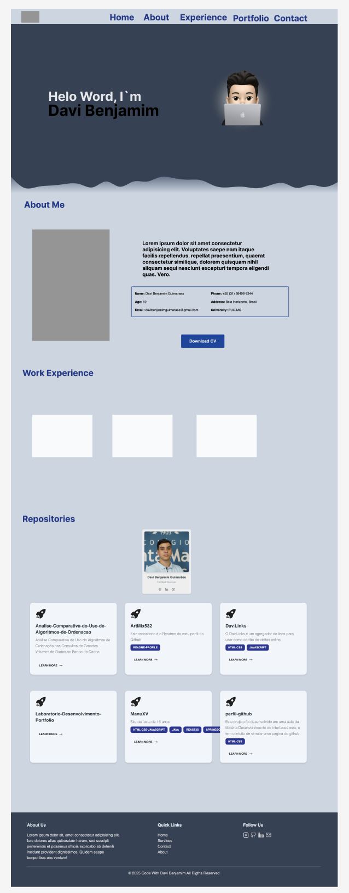

# 📌 Portfólio Pessoal  

Este é o nosso portfólio desenvolvido em **React**, com o objetivo de apresentar nossas habilidades em programação, nossos projetos e nossas experiências acadêmicas e profissionais.  

## 🚀 Tecnologias utilizadas  
- React  
- HTML5  
- CSS3  
- JavaScript (ES6+)  
- Git & GitHub

  

## 🖥️ Funcionalidades  
- **Seção Sobre Nós**: introdução coletiva e informações básicas sobre cada integrante.  
- **Experiência Profissional**: espaço para listar experiências relevantes do grupo.  
- **Repositórios Interativos**: integração em tempo real com nossos projetos do GitHub.  
- **Navegação Intuitiva**: barra de navegação (Home, About, Experience, Portfolio, Contact).  
- **Contato Direto**: aba para envio de e-mail caso alguém tenha interesse em nos contatar.  

## 📂 Estrutura do Portfólio  
1. **Sobre Nós** → apresentação inicial.  
2. **Experiência Profissional** → trajetória acadêmica e experiências.  
3. **Repositórios** → nossos principais projetos hospedados no GitHub.  
4. **Contato** → formulário para envio de mensagens diretamente para nós.  

## 🌐 Deploy  
O projeto será disponibilizado online para acesso direto, sem necessidade de instalação.   

## 📸 Preview  
 

## 👥 Integrantes  
- Jonas Rafael Martins 
- Davi Benjamim Guimarães
- Albert Luís Pereira de Jesus 

## 📬 Contato  
Caso queira entrar em contato conosco:  
- ✉️ Email:\
  [jonasrmartins17@gmail.com](mailto:jonasrmartins17@gmail.com)\
  [davibenjamimguimaraes@gmail.com](mailto:davibenjamimguimaraes@gmail.com)\
  [albertluis123y88@gmail.com](mailto:albertluis123y88@gmail.com)

- 🔗 LinkedIn:\
  [Jonas Rafael Martins](https://www.linkedin.com/in/jonas-martins-158544178/)\
  [Davi Benjamim Guimarães](https://www.linkedin.com/in/jonas-martins-158544178/)\
  [Albert Luís Pereira de Jesus](https://www.linkedin.com/in/jonas-martins-158544178/)
  
- 🐙 GitHub:\
  [Jonas Rafael Martins](https://github.com/Kjonps)\
  [Davi Benjamim Guimarães](https://github.com/ArtMix532)\
  [Albert Luís Pereira de Jesus](https://github.com/SrGuzz)
